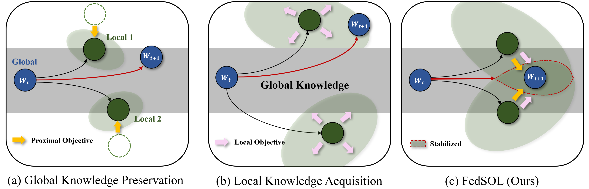

# FedSOL (Federated Stabilized Orthogonal Learning)

This repository is the official PyTorch implementation of:

[**"FedSOL: Stabilized Orthogonal Learning with Proximal Restrictions in Federated Learning (CVPR 2024)"**](https://openaccess.thecvf.com/content/CVPR2024/html/Lee_FedSOL_Stabilized_Orthogonal_Learning_with_Proximal_Restrictions_in_Federated_Learning_CVPR_2024_paper.html).



## Requirements

- This codebase is written for `python3` (used `python 3.8.8` while implementing).
- We use Pytorch version of `1.9.0` and `10.2`, `11.0` CUDA version.
- To install necessary python packages,  
    ```
    pip install -r requirements.txt
    ```

## How to Run Codes?

The configuration skeleton for each algorithm is in `./configs/*.json`. 
- `python ./main.py --config_path ./configs/algorithm_name.json` conducts the experiment with the default setups.

There are two ways to change the configurations:
1. Change (or Write a new one) the configuration file in `./config` directory with the above command.
2. Use parser arguments to overload the configuration file.
- `--dataset_name`: name of the datasets (e.g., `mnist`, `cifar10`).
  - for cinic-10 datasets, the data should be downloaded first using `./data/cinic10/download.sh`.
- `--n_clients`: the number of total clients (default: 100).
- `--batch_size`: the size of batch to be used for local training. (default: 50)
- `--partition_method`: non-IID partition strategy (e.g. `sharding`, `lda`).
- `--partition_s`: shard per user (only for `sharding`).
- `--partition_alpha`: concentration parameter alpha for latent Dirichlet Allocation (only for `lda`).
- `--model_name`: model architecture to be used (e.g., `fedavg_mnist`, `fedavg_cifar`).
- `--n_rounds`: the number of total communication rounds. (default: `300`)
- `--sample_ratio`: fraction of clients to be ramdonly sampled at each round (default: `0.1`)
- `--local_epochs`: the number of local epochs (default: `5`).
- `--lr`: the initial learning rate for local training (default: `0.01`)
- `--momentum`: the momentum for SGD (default: `0.9`).
- `--wd`: weight decay for optimization (default: `1e-5`)
- `-- algo_name`: algorithm name of the experiment (e.g., `fedavg`, `fedsol_adaptive`)
- `--seed`: random seed

## Reference Github

We refer to the following repositories:
- https://github.com/FedML-AI/FedML (For overall code structure1)
- https://github.com/Lee-Gihun/FedNTD (For overall code structure2)
- https://github.com/davda54/sam (For SAM-based optimization)
- https://github.com/JYWa/FedNova
- https://github.com/QinbinLi/MOON
- https://github.com/BayesWatch/cinic-10

## Citing this work

```
@inproceedings{lee2024fedsol,
  title={FedSOL: Stabilized Orthogonal Learning with Proximal Restrictions in Federated Learning},
  author={Lee, Gihun and Jeong, Minchan and Kim, Sangmook and Oh, Jaehoon and Yun, Se-Young},
  booktitle={Proceedings of the IEEE/CVF Conference on Computer Vision and Pattern Recognition},
  pages={12512--12522},
  year={2024}
}
```